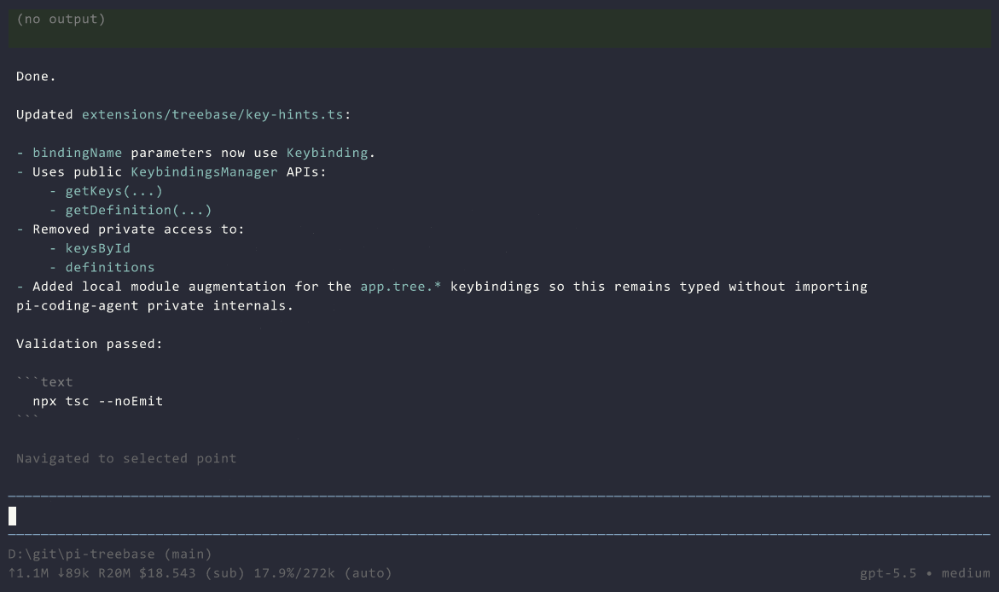

# pi-treebase

A session history management tool that combines the functionality of the base `/tree` command
with something similar to `git rebase --interactive`.



## Installation

```bash
pi install npm:@grayolson/pi-treebase
```

## Usage

First, use the `/treebase` and navigate with the normal tree session view to choose the destination
to rebase history to.

Then, use an interactive editor of flattened history to select what to **`P`ick** (keep verbatim),
summarize with **`L`ow** or **`H`igh** importance, or **`D`rop** entirely.

A new synthetic history branch is then created from the root you selected, interspersing actual
picked history entries with generated summaries.

Summaries are generated by a model with full context of the entire branch (except dropped entries),
but with instructions to only record a summary of the relevant section of the entire linear history
into each summary block so that summaries makes sense when interspersed with picked entries.

## Limitations

Currently, the only supported operation is to "rebase" directly back in time to a parent node.
Rebasing one branch past a junction on top of of another branch is not yet supported.

## Hacks

* Implementing this required (as far as I could tell) mutable access to pi's `SessionManager`, which
is usually exposed as only `ReadonlySessionManager` to command handlers. I did a bad and just
as-casted it to the writable version. I'm not sure exactly how bad the implications of this are.
* Using a custom message types as a summary message doesn't behave super well with normal tree
navigation, so I hackily pushed native branch summarization messages for this purpose by hooking
a private method.

I will likely try to file issues/PR the ability to do these non-hackily once the bigrefactor lands.

## Slop alert

Warning, this is moderately slop clanker code. It's been cleaned up a bit and I reviewed what I felt
were the important parts, but do with that what you will.